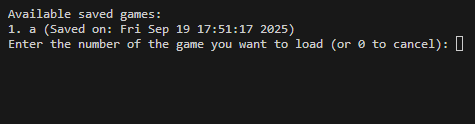
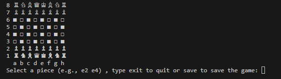
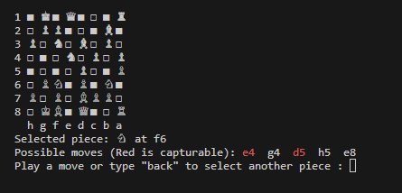

# Chessly ♟️
A CLI-based chess game engine and interface written in C++. This project provides a complete chess-playing experience in the terminal, featuring full move validation, game state detection, and the ability to save and load positions using FEN strings.

## Key Features

- **Full Chess Logic:** All standard moves are implemented, including pawn promotion, en passant, and castling.
- **Interactive Terminal Interface:** Play a full game from start to finish using the form Square to Square form (e.g., `e2`, `e4`) which I think is much easier for chess beginners to understand than the standard algebraic notaion -Just the distination as input-
- **Save & Load Games:** Games can be saved at any point and loaded later to resume play.
- **FEN Support:** Start a game from any board position by providing a valid Forsyth-Edwards Notation (FEN) string.

### Engine & Rule Validation
- **Legal Move Generation:** The engine accurately calculates all possible legal moves for any given piece, respecting pins and other complex board states.
- **Game State Detection:** The game automatically detects and announces key states:
  - Check & Checkmate
  - Stalemate
  - Draw by Insufficient Material
  - Draw by Threefold Repetition (Using Zobrist Hashing)
  - Draw by the 50/75-move rule


## Getting Started
Follow these instructions to compile and run the project on your local machine.

### Prerequisites
You will need a C++ compiler that supports C++17 or newer. The most common compiler is `g++`, which is part of the GCC toolchain.


### Building from Source
Clone the repository:

```bash
git clone https://github.com/ysfw/Chessly.git
```

Compile the source code:  
Use the following command to compile all necessary files into a single executable named `chessly`:

```bash
g++ -I. -o chessly main.cpp game.cpp pieces/*.cpp
```

> Note: The `-I.` flag tells the compiler to look for included header files in the current directory.

### Windows UTF-8 Note
On Windows, you may need to set the console to UTF-8 to properly display Unicode characters (The chess pieces).  
Run this command before executing the program:

```bash
chcp 65001
```

Run the game:

```bash
./chess
```

## How to Play
After launching the executable, you will be greeted with the main menu.

### Main Menu
```
--- Chessly ---
1. New Game
2. Load from FEN
3. Load Saved Game
4. Exit
Choose an option:
```

- **New Game:** Starts a standard game of chess from the initial board setup.
- **Load from FEN:** Prompts you to enter a FEN string to set up a custom board position.
- **Load Saved Game:** Lists previously saved games and allows you to resume one.

### Gameplay
- **Selecting a Piece:** To make a move, first enter the coordinate of the piece you want to move (e.g., `e2`).
- **Viewing Moves:** The game will display all legal moves for the selected piece. Capturable pieces are highlighted in red.
- **Making a Move:** Enter the coordinate of the destination square (e.g., `e4`).
- **Changing Selection:** If you want to select a different piece after viewing moves, simply type `back`.

## Screenshots
- Loading a saved game.


- screenshots of a game in progress, showing the ASCII board and move prompts.



